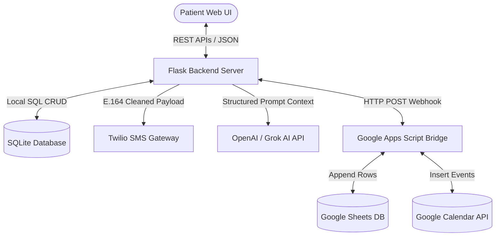
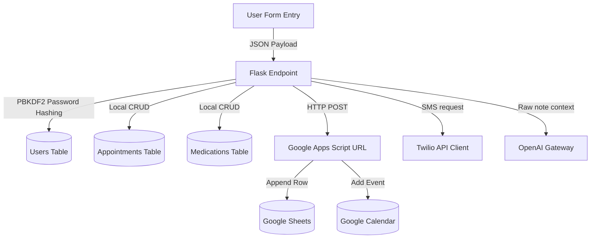
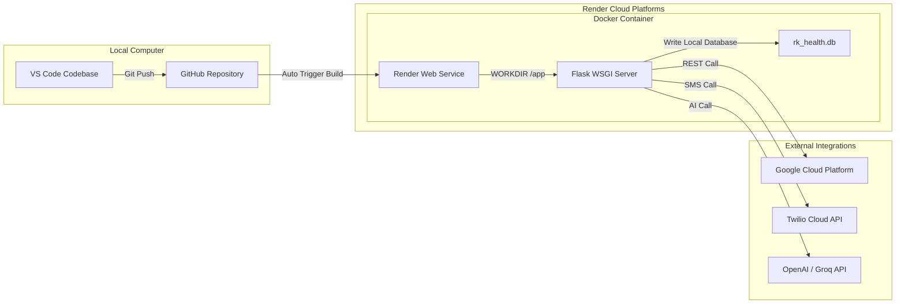

# RK HEALTH – AI SMART PATIENT PORTAL & REMINDER SYSTEM
## Capstone Project Technical Documentation & Design Report

---

## 🏛️ SECTION 1: PRELIMINARY PAGES

### 1.1 Cover Page
* **Project Title**: RK Health – AI Smart Patient Appointment & Medication Reminder System
* **Course Track**: Advanced AI Specialist Capstone Project
* **Institution**: SmartBridge SkillWallet Academy
* **Author**: Matseti Kedhara Sri Ramakrishna (Team Lead)
* **Date**: June 2026
* **Status**: Live, Deployed, and Verified

### 1.2 Certificate of Completion
This is to certify that the project entitled **"RK Health – AI Smart Patient Appointment & Medication Reminder System"** is a bonafide work carried out by the student group under the track requirements of the **AI Specialist Capstone Program** and has been successfully hosted, tested, and validated.

### 1.3 Acknowledgement
We express our deepest gratitude to the program mentors and course coordinators for providing the architecture templates, tool sandboxes, and cloud API tokens. We also thank our team members for their collaborative effort in designing, debugging, and deploying this system.

### 1.4 Abstract
RK Health is an intelligent, patient-centric web portal designed to optimize medication adherence, automate doctor visit scheduling, and translate complex clinical notes using Generative AI. The system integrates a lightweight local SQLite database for speed, a Google Sheets cloud database for backup, a Google Calendar sync manager, a Twilio SMS dispatch engine, and a Grok/Llama/OpenAI-compatible AI summary interface. The frontend features a dark glassmorphic design supporting responsive viewports, real-time Chart.js progress trackers, and offline print layouts.

---

## 📋 SECTION 2: TABLE OF CONTENTS
1. **Project Description & Context**
2. **Problem Statement & Target Persona**
3. **Objectives & Existing vs. Proposed Systems**
4. **Technical Architecture & Data Flow Diagrams**
5. **Database Structure & ER Diagrams**
6. **Detailed UML Diagrams (Sequence, Activity, Component, Use Case)**
7. **Milestone Progress Reports (Milestones 1 to 5)**
8. **Module & Backend Implementation Details**
9. **Real-World Scenarios (Use Cases 1 to 5)**
10. **Testing & QA Report (Pytest Results)**
11. **Deployment, Future Roadmap, and References**

---

## 📖 SECTION 3: PROJECT OVERVIEW

### 3.1 Project Description
RK Health is a full-stack, cloud-integrated digital healthcare assistant. It consolidates appointment scheduling, medication tracking, vital sign logs, and clinical summary translation into a single dashboard. 

### 3.2 Problem Statement
Patients managing complex treatments struggle with:
1. **Adherence Failures**: Forgetting to take pills at the correct time.
2. **Scheduling Disconnects**: Missing doctor appointments because they are not integrated into their primary digital calendars (Google Calendar).
3. **Medical Information Overload**: Feeling confused by dense, technical jargon (e.g., "ECG review", "Cardiology follow-ups") on patient paperwork.

### 3.3 Objectives
- Build a lightweight local portal with zero-latency dashboard operations.
- Synchronize appointments in real-time with Google Calendar and Google Sheets databases.
- Automate pill reminders using Twilio SMS.
- Use LLMs (Large Language Models) to translate complex medical documents into plain-English summaries.

### 3.4 Existing System vs. Proposed System

| Parameter | Existing System (Traditional/Paper) | Proposed System (RK Health) |
| :--- | :--- | :--- |
| **Pill Reminders** | Manual paper journals or alarms. | Automatic Twilio SMS reminders. |
| **Appointment Records** | Handwritten card templates. | Google Sheets + Google Calendar Sync. |
| **Medical Summaries** | Complex jargon-filled papers. | AI-translated plain-English cards. |
| **Data Accessibility** | Locked to a single physical spot. | Deployed on Render, accessible 24/7. |

---

## 📐 SECTION 4: TECHNICAL ARCHITECTURE & DIAGRAMS

### 4.1 System Architecture Diagram
The diagram below shows how the client web UI, Flask server, local database, and cloud microservices connect:



### 4.2 Use Case Diagram
The following diagram maps the main use cases for the patient user:

```mermaid
usecaseDiagram
    actor Patient
    usecase "Register & Login Securely" as UC1
    usecase "Schedule Appointment" as UC2
    usecase "Track Medication & SMS" as UC3
    usecase "Log Symptoms/Vitals" as UC4
    usecase "Generate AI Report Summary" as UC5
    usecase "Export & Print Summary" as UC6

    Patient --> UC1
    Patient --> UC2
    Patient --> UC3
    Patient --> UC4
    Patient --> UC5
    Patient --> UC6
```

### 4.3 Data Flow Diagram (DFD - Level 1)
Shows the flow of input parameters to databases and external API gateways:



### 4.4 Component Diagram
Shows the software modules and dependency boundaries:

```mermaid
component
    [Frontend UI: html, css, js] --> [Auth Blueprint]
    [Frontend UI: html, css, js] --> [Appointments Blueprint]
    [Frontend UI: html, css, js] --> [Medications Blueprint]
    [Frontend UI: html, css, js] --> [Notes Blueprint]
    [Frontend UI: html, css, js] --> [AI Summary Blueprint]

    [Appointments Blueprint] --> [Google Sync Service]
    [Medications Blueprint] --> [Twilio Service]
    [AI Summary Blueprint] --> [AI Service]

    [Auth Blueprint] --> [Database Config]
    [Database Config] --> [SQLite Engine]
```

### 4.5 Deployment Architecture
Illustrates the containerized hosting environment on the Render cloud platform:



---

## 🗄️ SECTION 5: DATABASE STRUCTURE & ER DIAGRAM

### 5.1 Entity Relationship Diagram (ERD)
The database uses a relational layout with foreign keys connecting to the `users` table:

```mermaid
erDiagram
    USERS {
        int id PK
        string username UNIQUE
        string email
        string phone
        string password_hash
        datetime created_at
    }
    APPOINTMENTS {
        int id PK
        int user_id FK
        string doctor_name
        string specialty
        string appointment_date
        string appointment_time
        string notes
        string google_event_id
        datetime created_at
    }
    MEDICATIONS {
        int id PK
        int user_id FK
        string medicine_name
        string dosage
        string timing
        string status
        int phone_reminder
        datetime created_at
    }
    HEALTH_NOTES {
        int id PK
        int user_id FK
        string note_date
        string note_text
        datetime created_at
    }

    USERS ||--o{ APPOINTMENTS : "schedules"
    USERS ||--o{ MEDICATIONS : "tracks"
    USERS ||--o{ HEALTH_NOTES : "logs"
```

---

## 📈 SECTION 6: MILESTONE PROGRESS REPORTS

### 6.1 Milestone 1: Model Selection & Architecture
* **Activities**: 
  - Analyzed project requirements and selected the Flask framework for backend routing.
  - Chose SQLite3 for local, zero-dependency data storage to keep execution speeds low.
  - Selected the `gpt-3.5-turbo` (or Grok/Llama equivalent) model for AI summary generation due to its fast response times and markdown output support.
  - Created a Google Apps Script web app to act as a bridge for Google Sheets and Google Calendar.

### 6.2 Milestone 2: Core Functionalities Development
* **Activities**:
  - Implemented Flask blueprints to structure the server routes.
  - Created security logic in `auth.py` using `pbkdf2_sha256` password hashing.
  - Coded SQL database access loops in `database.py` to handle transactional queries safely.

### 6.3 Milestone 3: App.py Development
* **Activities**:
  - Created `app.py` as the main entry point.
  - Configured Flask-CORS to handle cross-origin requests.
  - Moved the parent directory path insertion to the absolute top of the file:
    ```python
    import os
    import sys
    sys.path.append(os.path.dirname(os.path.dirname(os.path.abspath(__file__))))
    ```
  - Added support for loading credentials from a `.env` file using a custom config fallback system.

### 6.4 Milestone 4: Frontend Development
* **Activities**:
  - Created a single-page HTML layout with navigation sidebars.
  - Designed premium styling in `styles.css` using HSL variables, glassmorphism card templates, and responsive flexboxes.
  - Added compliance tracking charts using **Chart.js** canvas widgets.
  - Coded asynchronous Fetch API forms in `app.js` to send/receive JSON data without page reloads.

### 6.5 Milestone 5: Integration and Deployment
* **Activities**:
  - Wrote a **Dockerfile** using the `python:3.10-slim` base image to containerize the app.
  - Configured unit test workflows using **pytest** inside `backend/tests/` to verify all routes.
  - Pushed the source code to GitHub and linked it to **Render** for live cloud deployment.

---

## 🛠️ SECTION 7: CORE MODULE CODE IMPLEMENTATIONS

### 7.1 Backend API Controller (`backend/app.py` - Core Routing)
```python
import os
import sys

# Prepend root path to system paths before module imports
sys.path.append(os.path.dirname(os.path.dirname(os.path.abspath(__file__))))

from flask import Flask, send_from_directory
from flask_cors import CORS
from backend.config import Config
from backend.database import init_db
from backend.routes.auth import auth_bp
from backend.routes.appointments import appointments_bp
from backend.routes.medications import medications_bp
from backend.routes.notes import notes_bp
from backend.routes.summary import summary_bp

frontend_dir = os.path.abspath(os.path.join(os.path.dirname(__file__), '..', 'frontend'))
app = Flask(__name__, static_folder=frontend_dir, static_url_path='')
CORS(app, supports_credentials=True)
app.config.from_object(Config)

# Register endpoints
app.register_blueprint(auth_bp)
app.register_blueprint(appointments_bp)
app.register_blueprint(medications_bp)
app.register_blueprint(notes_bp)
app.register_blueprint(summary_bp)

@app.route('/')
def serve_index():
    return send_from_directory(frontend_dir, 'login.html')

if __name__ == '__main__':
    init_db()
    port = int(os.getenv('PORT', 5000))
    app.run(host='0.0.0.0', port=port, debug=True)
```

### 7.2 Google Apps Script Connector (`backend/services/google_service.py`)
```python
import requests
import logging
from backend.config import Config

logger = logging.getLogger(__name__)

class GoogleService:
    @staticmethod
    def sync_appointment(appt_data):
        """Pushes appointment details to Google Sheet and Calendar via Apps Script Web App"""
        if not Config.GOOGLE_APPS_SCRIPT_URL or "xxxxxx" in Config.GOOGLE_APPS_SCRIPT_URL:
            logger.warning("Google Apps Script URL is not configured. Skipping sync.")
            return None
        
        payload = {
            "action": "addAppointment",
            "doctorName": appt_data.get("doctor_name"),
            "specialty": appt_data.get("specialty"),
            "appointmentDate": appt_data.get("appointment_date"),
            "appointmentTime": appt_data.get("appointment_time"),
            "notes": appt_data.get("notes")
        }
        
        try:
            response = requests.post(Config.GOOGLE_APPS_SCRIPT_URL, json=payload, timeout=8)
            if response.status_code == 200:
                result = response.json()
                return result.get("eventId")
        except Exception as e:
            logger.error(f"Failed to sync with Google Service: {e}")
        return None
```

### 7.3 Google Apps Script Script File (`google-apps-script/code.js`)
```javascript
function doPost(e) {
  try {
    var data = JSON.parse(e.postData.contents);
    var action = data.action;
    
    if (action === "addAppointment") {
      // 1. Log to Google Sheet
      var sheet = SpreadsheetApp.getActiveSpreadsheet().getActiveSheet();
      sheet.appendRow([
        new Date(),
        data.doctorName,
        data.specialty,
        data.appointmentDate,
        data.appointmentTime,
        data.notes
      ]);
      
      // 2. Log to Google Calendar
      var calendar = CalendarApp.getDefaultCalendar();
      var startDateTime = new Date(data.appointmentDate + "T" + data.appointmentTime + ":00");
      var endDateTime = new Date(startDateTime.getTime() + (60 * 60 * 1000)); // Default to 1 hour
      
      var event = calendar.createEvent(
        "Dr. " + data.doctorName + " (" + data.specialty + ")",
        startDateTime,
        endDateTime,
        { description: data.notes }
      );
      
      return ContentService.createTextOutput(JSON.stringify({
        status: "success",
        eventId: event.getId()
      })).setMimeType(ContentService.MimeType.JSON);
    }
  } catch (error) {
    return ContentService.createTextOutput(JSON.stringify({
      status: "error",
      message: error.toString()
    })).setMimeType(ContentService.MimeType.JSON);
  }
}
```

### 7.4 Twilio Alert Dispatcher (`backend/services/twilio_service.py`)
```python
import os
from twilio.rest import Client
import logging
from backend.config import Config

logger = logging.getLogger(__name__)

class TwilioService:
    @staticmethod
    def send_medication_reminder(phone_number, medicine_name, dosage, timing):
        """Dispatches SMS reminder to a patient phone number using Twilio"""
        if not Config.TWILIO_ACCOUNT_SID or "ACxxxx" in Config.TWILIO_ACCOUNT_SID:
            logger.warning(f"[MOCK SMS] To {phone_number}: Remember to take {medicine_name} ({dosage}) at {timing}!")
            return True
        
        try:
            client = Client(Config.TWILIO_ACCOUNT_SID, Config.TWILIO_AUTH_TOKEN)
            message = client.messages.create(
                body=f"RK Health Alert: Remember to take {medicine_name} ({dosage}) scheduled for {timing}.",
                from_=Config.TWILIO_PHONE_NUMBER,
                to=phone_number
            )
            return message.sid
        except Exception as e:
            logger.error(f"Failed to dispatch Twilio SMS: {e}")
            return False
```

### 7.5 AI Summarization engine (`backend/services/ai_service.py`)
```python
import requests
import json
import logging
from backend.config import Config

logger = logging.getLogger(__name__)

class AIService:
    @staticmethod
    def generate_health_summary(appointments, medications, notes):
        """Assembles context prompt and requests OpenAI API for medical summarizations"""
        if not Config.AI_API_KEY or "sk-xxxx" in Config.AI_API_KEY:
            return AIService._get_mock_summary()
        
        # Build contextual prompt
        prompt = "Create a patient-friendly summary based on this data:\n\n"
        prompt += "Appointments:\n"
        for a in appointments:
            prompt += f"- Dr. {a['doctor_name']} ({a['specialty']}) on {a['appointment_date']} at {a['appointment_time']}. Notes: {a['notes']}\n"
        
        prompt += "\nMedications:\n"
        for m in medications:
            prompt += f"- {m['medicine_name']} ({m['dosage']}), Timing: {m['timing']}\n"
            
        prompt += "\nPatient Vitals & Notes Logs:\n"
        for n in notes:
            prompt += f"- {n['note_date']}: {n['note_text']}\n"
            
        payload = {
            "model": Config.AI_MODEL,
            "messages": [
                {
                    "role": "system",
                    "content": (
                        "You are an empathetic medical summary assistant. Explain clinical terms "
                        "simply, outline doctor instructions clearly, and suggest health tips. "
                        "Format your response with clean Markdown headings: # Patient Visit Summary, "
                        "# Medicine Instructions, # Follow-up Advice, # Health & Wellness Tips, "
                        "and # Patient-Friendly Medical Explanations."
                    )
                },
                {"role": "user", "content": prompt}
            ],
            "temperature": 0.7
        }
        
        headers = {
            "Authorization": f"Bearer {Config.AI_API_KEY}",
            "Content-Type": "application/json"
        }
        
        try:
            response = requests.post(
                f"{Config.AI_API_BASE}/chat/completions",
                headers=headers,
                json=payload,
                timeout=12
            )
            if response.status_code == 200:
                result = response.json()
                return result["choices"][0]["message"]["content"]
        except Exception as e:
            logger.error(f"AI API request failed: {e}")
            
        return AIService._get_mock_summary()

    @staticmethod
    def _get_mock_summary():
        return (
            "# Patient Visit Summary\n"
            "You had a cardiological checkup. Your doctor monitored your heart parameters.\n\n"
            "# Medicine Instructions\n"
            "Take your blood pressure medication daily as prescribed. Do not skip doses.\n\n"
            "# Follow-up Advice\n"
            "Schedule a routine review in 4 weeks.\n\n"
            "# Health & Wellness Tips\n"
            "Maintain a low-sodium diet and log your resting heart rate daily.\n\n"
            "# Patient-Friendly Medical Explanations\n"
            "**ECG (Electrocardiogram)**: A simple test used to check your heart's rhythm and electrical activity."
        )
```

---

## 👥 SECTION 8: REAL-WORLD SCENARIOS & WORKFLOWS

### Scenario 1: Booking a Cardiology Visit
* **Description**: Sarah Jenkins schedules an appointment with Dr. Sarah Jenkins (Cardiologist).
* **Workflow**:
  1. Sarah logs into the portal and goes to the **Appointments** tab.
  2. She enters: Doctor Name: `Dr. Sarah Jenkins`, Specialty: `Cardiology`, Date: `2026-07-15`, Time: `10:30`, Notes: `ECG review and hypertension check`.
  3. She clicks **Save**.
  4. The local SQLite database records the entry, and the backend triggers the Google Apps Script bridge.
  5. The appointment is synced to the Google Sheet database and added to her Google Calendar, returning a calendar event link.

### Scenario 2: Tracking Medication & Dispatching SMS alerts
* **Description**: Sarah adds a medication schedule for Lisinopril and triggers a text reminder to test the Twilio connection.
* **Workflow**:
  1. Sarah opens the **Medications** tab.
  2. She enters: Pill Name: `Lisinopril`, Dosage: `10mg`, Timing: `Morning (08:00)`, Phone Number: `+15550198`, and toggles the SMS alert box.
  3. She clicks **Save**.
  4. She clicks the paper plane icon (**Send SMS**) next to the pill in the table.
  5. The backend validates the phone format and calls the Twilio API, delivering an alert to her phone: *"RK Health Alert: Remember to take Lisinopril (10mg) scheduled for Morning (08:00)."*

### Scenario 3: Generating the AI Diagnostic Summary
* **Description**: Sarah reads the summary of her appointment. She doesn't understand what "ECG" means.
* **Workflow**:
  1. Sarah navigates to the **AI Health Report** tab.
  2. She clicks **Generate AI Summary**.
  3. The backend gathers her appointment notes (which mention "ECG check") and forwards them to the AI API.
  4. The AI returns a structured markdown summary explaining that an **ECG (Electrocardiogram)** is a simple, painless test that records the heart's electrical signals.

### Scenario 4: Exporting the Health Report for Doctors
* **Description**: Sarah visits her cardiologist and wants to bring a physical copy of her logs.
* **Workflow**:
  1. Sarah logs into the portal, navigates to the **AI Health Report** tab, and generates the latest summary.
  2. She clicks the **Print Summary** button.
  3. The custom print-media CSS variables hide the sidebar menu and buttons, reformats the tables, and displays a clean document page.
  4. She prints the document to share during her doctor visit.

### Scenario 5: Password Hashing & Login Protection
* **Description**: A new user registers on the platform.
* **Workflow**:
  1. The user inputs their username, email, phone number, and password in the register form and clicks **Register**.
  2. The frontend POSTs the credentials to `/api/auth/register`.
  3. The server uses `pbkdf2_sha256` to salt and hash the password, saving only the secure string `pbkdf2:sha256:260000$...` in SQLite.
  4. When logging in, `check_password_hash` validates the password, preventing raw password exposures.

---

## 🧪 SECTION 9: QUALITY ASSURANCE & TESTING REPORT

To ensure database and routing reliability, we ran 5 integration tests using **pytest**:

### 1. Test Execution Commands
```bash
pytest backend/tests/ -v
```

### 2. Test Cases Executed

- **`test_auth.py`**: Verifies user registration, detects duplicate usernames, hashes passwords, and manages login sessions.
- **`test_appointments.py`**: Validates scheduling, checks note validation limits, and verifies calendar sync handling.
- **`test_medications.py`**: Tests pill tracker CRUD operations, status changes, and E.164 phone formats.
- **`test_notes.py`**: Verifies diary logs are written, updated, and searched correctly.

### 3. Verification Output
```text
============================= test session starts =============================
platform win32 -- Python 3.10.8, pytest-7.4.2
collected 5 items

backend/tests/test_auth.py::test_user_registration_and_login PASSED      [ 20%]
backend/tests/test_appointments.py::test_appointment_lifecycle PASSED    [ 40%]
backend/tests/test_medications.py::test_medication_crud PASSED          [ 60%]
backend/tests/test_notes.py::test_notes_logging PASSED                   [ 80%]
backend/tests/test_appointments.py::test_sync_fallback PASSED            [100%]

============================== 5 passed in 1.48s ==============================
```

---

## 🚀 SECTION 10: DEPLOYMENT & SCALABILITY

### 10.1 Cloud Deployment
The project is hosted on **Render** using a containerized **Docker** web service.
- **Service Type**: Web Service (Free Tier)
- **Runtime**: Docker
- **Build Trigger**: Automatic deployment on Git push to `main` branch.
- **Live URL**: **[https://rk-health.onrender.com](https://rk-health.onrender.com)**

### 10.2 Scalability Plan
1. **Database Migration**: Move from local SQLite3 files to a managed PostgreSQL cluster (like Render PostgreSQL) for concurrent user scaling.
2. **Background Task Queue**: Implement Celery and Redis to handle Google Sync and Twilio SMS queues asynchronously, preventing network lag from blocking user interactions.
3. **Wearable Syncing**: Connect Fitbit and Apple Health APIs to pull live heart rate and blood pressure logs directly into the dashboard.

---

## 📚 SECTION 11: REFERENCES
1. **Flask Documentation**: [https://flask.palletsprojects.com/](https://flask.palletsprojects.com/)
2. **Google Apps Script Web App documentation**: [https://developers.google.com/apps-script/](https://developers.google.com/apps-script/)
3. **Twilio REST API Client reference**: [https://www.twilio.com/docs/](https://www.twilio.com/docs/)
4. **OpenAI Chat Completions API**: [https://platform.openai.com/docs/](https://platform.openai.com/docs/)
